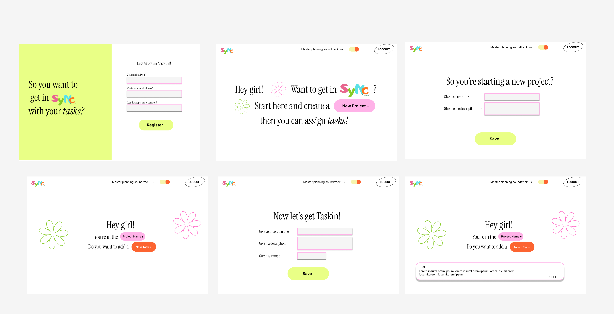
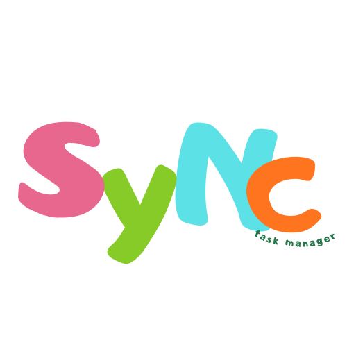

# She Sync- Front-end!
## Andrea E
*1/28/26*

### Install Instructions

### Planning
In the design phase I have already designed 4 iterations of one design and one iteration of another. I am done designing but think there was a better way to streamline the User Flow so that I could use less screens. However I do think because so much of my designs I designed to be re-used as either components, or have the same style that will allow me to cut down on time when it comes to design and styling.
Here is my current design flow: 

#### Frontend
1. Features:
    - Task management by Projects
    - Delete Tasks
    - Create Tasks
    - Project toggle
    - Music toggle
    - Task status management
    - Updates (need to think more about what updates, like edit the task, edit the due date?)
2. Screens:
    - Register
    - Login
    - Projects
    - Add Projects
    - Transition Screen
    - Add task details
    - Populated Tasks
3. Reusable components
    - Form textboxes
    - Buttons
    - Header
    - Sidebar for projects
    - Project modal
    - Task modal
    - Task cards
    - Status toggle or drop-down
4. CRUD On:
   - User (partial)
   - Projects
   - Tasks 

5. Design:
  - Title: She Sync
  - Logo: 
  - Colors : The neon green: E9FF86, The Pink: FFB2E8, F6F5AE , FC6431, black #0E0C0C
  - Font: Instrument Serif
6. State Logic:
 So projects will have to be tracked I plan on using a drop down as I think that will make it much easier, and then the project selected will have to be loaded, because tasks are nested in projects that should be easier to handle than by user. A user will also have to update task status, add tasks, and delete tasks. 

 So I just finished my login and register page yesterday and I had a dream that my Userflow was broken. I woke up and surely enough, I had no place to have the user add more projects, surely enough that was true however getting a consultation the fix will be to add the option for a new project in the project drop down that will trigger the project modal. 

### Resources:
- [Hook Ideas](https://usehooks.com/)
- [Sound feature idea](https://www.youtube.com/watch?v=U1T_J6Odoqg)
- [Planning custom hooks](https://kentcdodds.com/blog)
- [Music hook](https://dev.to/nicomartin/how-to-create-a-progressive-audio-player-with-react-hooks-31l1)
- [Setup reminders](https://medium.com/@sindoojagajam2023/authentication-with-jwt-in-mern-stack-applications-c6edc05db11e)
- [Axios](https://blog.logrocket.com/using-axios-with-react-native-manage-api-requests/#make-requests-api-using-axios)
- [Dropdown select](https://www.youtube.com/watch?v=ARcbDPLL564)
- [Toggle](https://www.w3schools.com/howto/howto_css_switch.asp)
- [Keyframe spin](https://stackoverflow.com/questions/37376443/animating-keyframes-with-transition-for-rotation-in-css3)
- [Music toggle](https://dev.to/logrocket/building-an-audio-player-in-react-to-play-sound-or-music-4084)